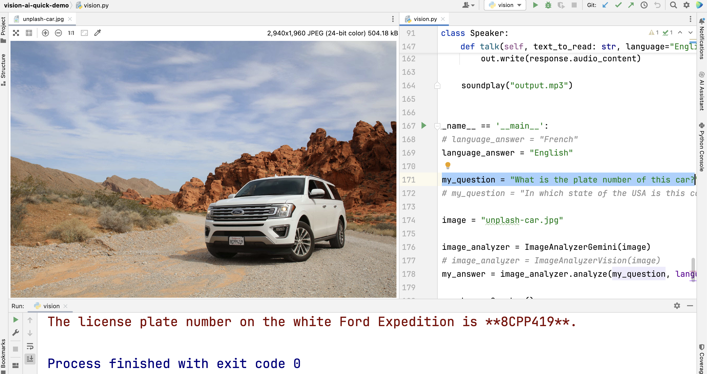

This code gives some examples on how to use Google GenAI out-of-the-box tools to query/analyze an image
with a natural language question.

The "Text To Speech" Google API is also used, to put a voice on top of the answer returned by the image analysis.

### Configuration of the Google Cloud project

To try this code, the Vertex AI API must be activated.
With *gcloud* this can be done as such:

`gcloud services enable aiplatform.googleapis.com`

Before running the Python code on your laptop, remember also to execute the famous command:
`gcloud auth application-default login`

### Vision models used

The code shows 2 different APIs to analyze the image:
1. the "Google ProVision" API (https://cloud.google.com/vertex-ai/generative-ai/docs/image/visual-question-answering), used in the class *ImageAnalyzerVision*
2. the "Gemini (multimodal)" API (https://cloud.google.com/vertex-ai/generative-ai/docs/multimodal/image-understanding), used in the class *ImageAnalyzerGemini*

By default, only the Gemini API is being used. Feel free to (un)comment some lines of code in the *main* block to use the other API.

In my tests **I have seen Gemini performing much better than the ProVision API**. In the current example, the ProVision is not capable to give a valid answer about the plate number.

I find it a bit strange, because the image is quite neat and I have seen the ProVision API capable to give good results 
on another image with very blurry numbers
(unfortunately, for licensing reasons I cannot share the corresponding image on this GitHub repo)

Another limitation of the ProVision API is that the answers are very basic.
This is why in my example I combine it with Gemini in order to obtain a "full sentence answer".
By doing so, we can also get the answer in another language (English being the one used by default in my code).

A feature I particularly appreciate from **Gemini is the enforcement of a JSON schema to format the answer**.
Uncomment the last 2 lines of the code to test it.

### Text to speech configuration

By selecting a different language in the *main* block of the code, the code will not only
translate the answer into that language, but it will also use the corresponding language pronunciation during the "text to speech" phase.

Google supports many different languages, and each one has several *voice* variants.
The code here does not reference all the possibilities. If you miss one, adjust accordingly the *_get_voice_config()* method.

### Do your own tests!

Don't hesitate to (un)comment some lines in the *main* block or to change some variables to:
- ask a different question
- use another image (just copy your image file on this current folder, and replace *unplash-car.jpg* by the new file name )
- switch between the Gemini and the ProVision model
- get your answer in another language

### About the image

All the credits for this nice image to *Sven D*, who published it
on Unsplash (https://unsplash.com/photos/parked-white-ford-explorer-suv-a4S6KUuLeoM) under the Unspash license.

### About this Git repository
This code is provided by me as an example. It is not meant to be run in any "production environment", and I don't have any plan to actively maintain it.
